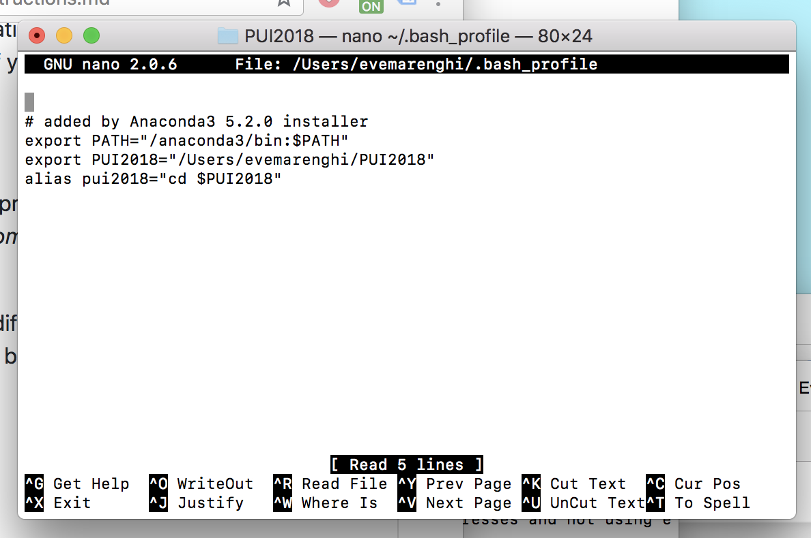
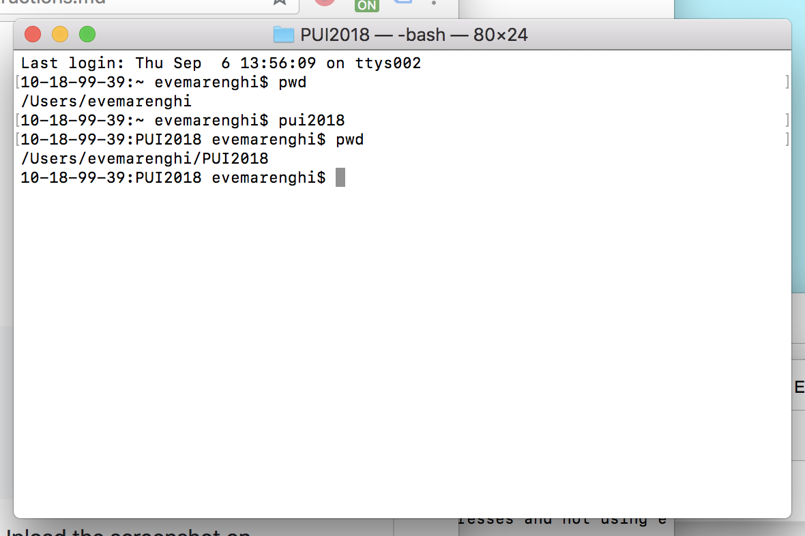

To set up my environment, I created an environmental variable called PUI2018 that points to a folder on my machine with the path /Users/evemarenghi/PUI2018. I also created an alias called pui2018 that takes me into the folder /Users/evemarenghi/PUI2018 when executed by referencing the environmental variable PUI2018. 

