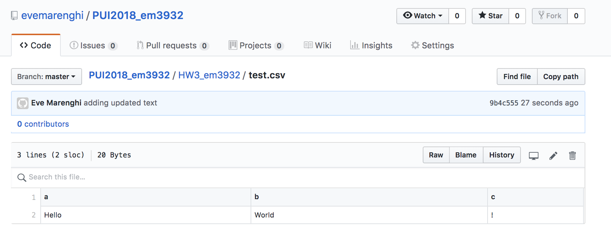
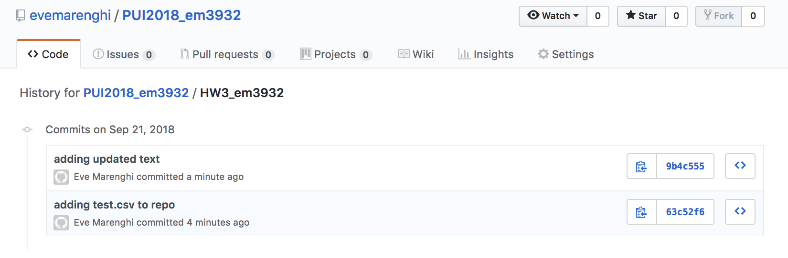
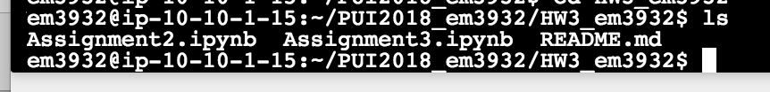
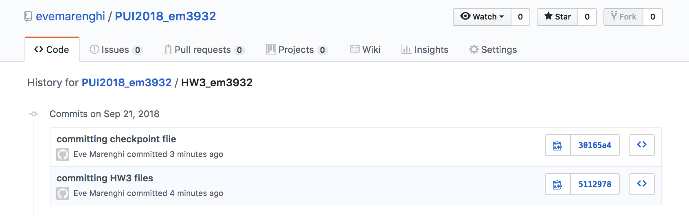

Creating a CSV file called test.csv in my repo 

HW3_em3932 folder history showing creating of test.csv

Removed the file from my local using git commands provided 

HW3_em3932 history showing no record of the test.csv file

