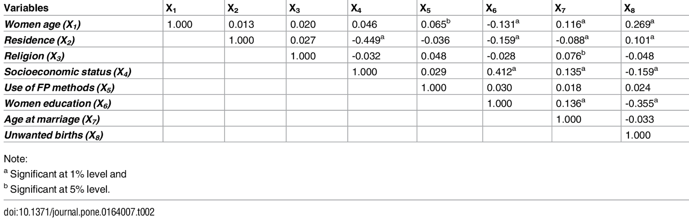

## Assignment 1: Review a classmate's Citibike project proposal

For part 1 of the homework, I was assigned a classmate's Citibike project proposal to review. I evaluated my classmate's formulation of the null and alternative hypotheses. I then reviewed my classmate's manipulation of the data to get it into the right form to test the null hypothesis. I then selected a statistical test to test the null hypothesis and explained my reasoning. 

## Assignment 2: Literature choices of statistical tests

For part 2 of the homework, I chose 3 statistical tests from the table provided. I searched the online journal Plos One to find papers that utilized each of the 3 tests I selected. For each paper, I scanned and identified features used in the statistical test (such as independent variable, independent variable type, dependent variable, dependent variable type). I also included a screenshot of the main plot for each statistical test. This exercise helped me to get a better understanding of how statistical tests are used in research and how statistical tests are presented in scientific journals. 

## Test 1: Ancova

| **Statistical Analyses**	|  **IV(s)**  |  **IV type(s)** |  **DV(s)**  |  **DV type(s)**  |  **Control Var** | **Control Var type**  | **Question to be answered** | **_H0_** | **alpha** | **link to paper**| 
|:----------:|:----------|:------------|:-------------|:-------------|:------------|:------------- |:------------------|:----:|:-------:|:-------|
ANCOVA	| 1, working status (full-time worker, part-time worker, non-worker) | categorical | 1 - health (defined by 3 indicators: self-rated health, mental health (GDS15), HLFC (Higher-Level Functional Capacity)| ordinal | 1, prior working status (full-time worker) | categorical | 	Are Japanese people from Wako city age 65 and older who continue working healthier than Japanese people from Wako city age 65 and older who retire?  | Retiree health >= Worker health | 0.01 | [Effects of the Change in Working Status on the Health of Older People in Japan](https://journals.plos.org/plosone/article?id=10.1371/journal.pone.0144069) |

## Main plot: 

## Test 2: Path Analysis

| **Statistical Analyses**	|  **IV(s)**  |  **IV type(s)** |  **DV(s)**  |  **DV type(s)**  |  **Control Var** | **Control Var type**  | **Question to be answered** | **_H0_** | **alpha** | **link to paper**| 
|:----------:|:----------|:------------|:-------------|:-------------|:------------|:------------- |:------------------|:----:|:-------:|:-------|
Path analysis	| 8, woman's age, place of residence, religion, socioeconomic status, use of family planning methods, woman's education, age at first marriage, unwanted births | categorical & continuous | 1 - percentage of unwanted births | continuous | 0 | n/a | 	What are the direct and indirect effects of socio-demographic factors on unwanted births in Bangladesh? | socio-demographic factors have no effect on unwanted births in Bangladesh | 0.01 | [Correlates of Unwanted Births in Bangladesh: A Study through Path Analysis](https://journals.plos.org/plosone/article?id=10.1371/journal.pone.0164007) |

## Main table: 

## Test 1: Logistic Regression

| **Statistical Analyses**	|  **IV(s)**  |  **IV type(s)** |  **DV(s)**  |  **DV type(s)**  |  **Control Var** | **Control Var type**  | **Question to be answered** | **_H0_** | **alpha** | **link to paper**| 
|:----------:|:----------|:------------|:-------------|:-------------|:------------|:------------- |:------------------|:----:|:-------:|:-------|
Logistic regression	| 1, age | continuous | 1, selected for final interview or not | dichotomous | 0 | n/a | 	Does age have an effect in the astronaut final interview selection process? | age has no effect on being selected for final interview | 0.05 | [Analysis of age as a factor in NASA astronaut selection and career landmarks](https://journals.plos.org/plosone/article?id=10.1371/journal.pone.0181381) |

## Main plot:

## Assignment 3: Reproduce the analysis of the Hard to Employ program in NY

For part 3 of the homework, I reproduced the analysis of the hard to employ program in NY. I read about the program to get an idea of how the study worked. I then developed a null hypothesis for the relationship between participation in the program and employment after release from prison. I also developed a null hypothesis for the relationship between participation in the program and conviction of a felony within 1-3 years after release from prison. I tested the felony null hypothesis by replicating the z-test and the chi-square test that Professor Bianco demonstrated. I then assessed the null hypothesis based on the results of my statistical testing (z-test and chi-square test). 

## Assignment 4: Tests of correlation using the scipy package with citibike data

For part 4 of the homework, I selected some CitiBike datasets from the CitiBike website. I read the datasets into Pandas dataframes and wrangled the data to get into the format that I needed. I then performed correlation tests on the data using three correlation tests - K-S test, Pearson's test, and Spearman's test. The first correlation I assessed was the correlation between time of day for the trip (day vs. night) and trip duration. Once I completed each of the correlation tests using scipy functions, I assessed the results in the context of the null hypothesis for each test. 

