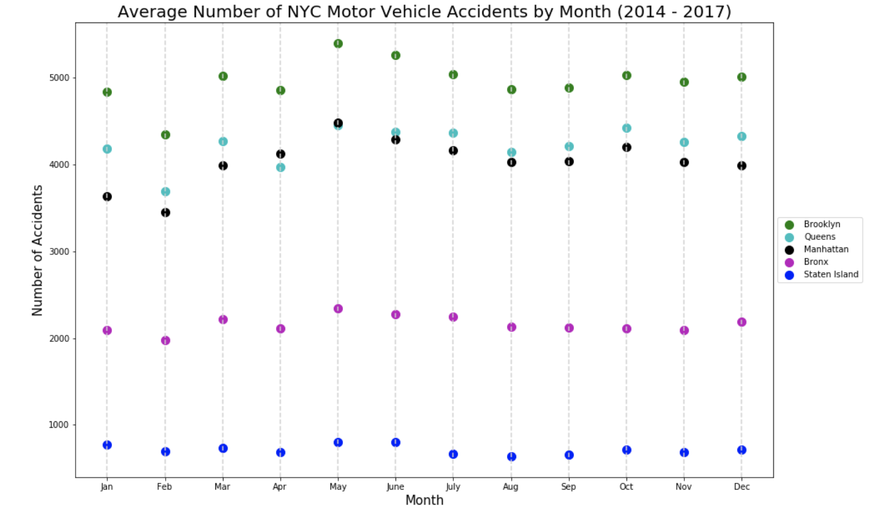

For part 1 of this homework, I create a plot of motor vehicle accidents in NYC from a dataset provided by NYC Open Data. 

Figure 1: The plot above shows average number of motor vehicle accidents by month and borough in NYC for 2014 - 2017. We see that Brooklyn has the highest average number of accidents in every month and Staten Island has the lowest average number of accidents in every month. Average number of accidents is relatively similar throughout the entire year in the Bronx and Staten Island. There is more variability in the average number of accidents per month throughout the year in Brooklyn, Queens, and Manhattan. In Brooklyn, Queens, and Manhattan, the highest average number of accidents is in May. Queens has a higher average number of accidents than Manhattan in every month aside from May, when average number of accidents in Manhattan slightly surpasses Queens. The borough with the largest population is Brooklyn, followed by Queens, Manhattan, the Bronx, and Staten Island. For this reason, it makes sense that Brooklyn has the most accidents throughout the year, followed by Queens, Manhattan, the Bronx, and Staten Island.

For part 2 of this homework, I revisited my hypothesis about CitiBike data from HW4 and tested my null hypothesis using a statistical test. I wrote up a short report that can be found [here].(https://www.authorea.com/335791/CODt7lkE3b_VONSHhN9rtA)

