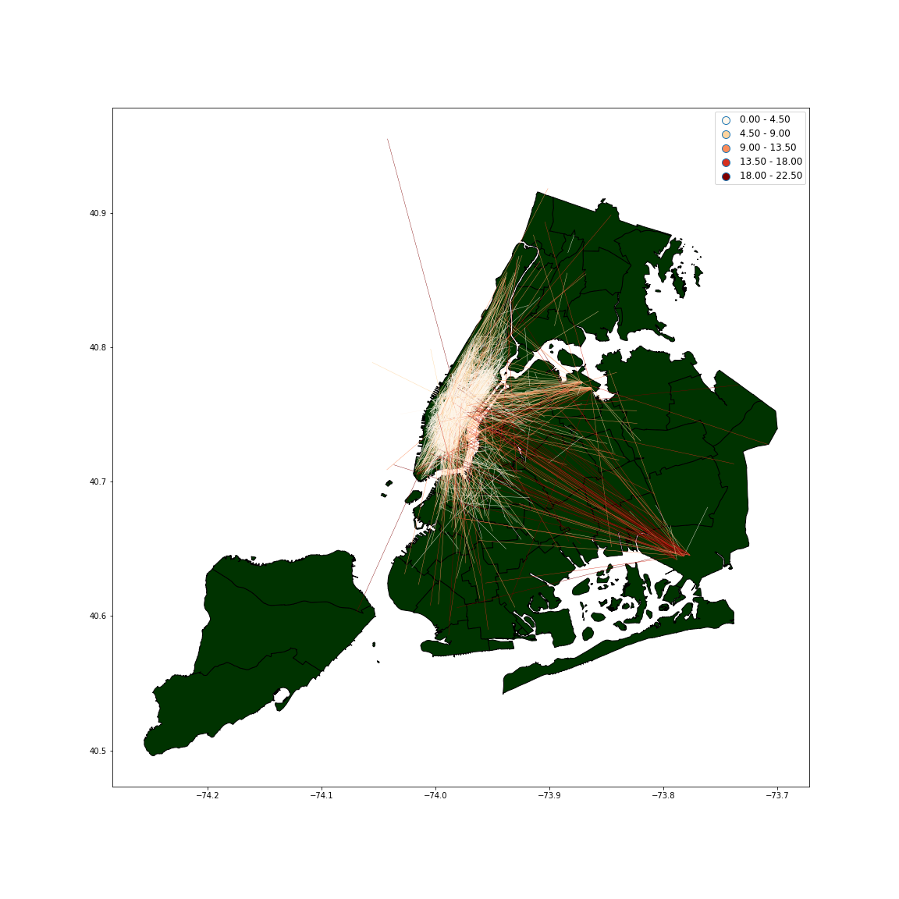

**Caption**: This figure shows 2000 randomly chosen yellow taxi trip in 06/09/2016, the more red line means the longer trip distance, the more yellow line means the shorter trip distance. From this plot, we can tell that most taxi trips were within Manhattan, nearly all the long trips were between Manhattan and JFK. The two main destination out of Manhattan is JFK and LaGuardia Airport. There was a relatively active communication between Manhattan and South Brooklyn.

**Eve's Review**: 
There are no units specified on the legend or in the caption, so I’m not sure what measurement the lines are showing (I assume the units are miles). Within Manhattan, the map looks completely white, so I can’t distinguish individual trips. The plot is not color blind compliant. Using the Color Oracle simulator, I can see that someone with deuteranopia or protanopia would not be able to distinguish the difference between the lines. For someone who is not color blind, it’s clear that redder lines visualize longer trips and whiter lines visualize shorter trips. The plot does not seem to be deforming the data. However, I’m not sure what the original data source was – all NYC taxi trips on 6/9/16, or only taxi trips that began in Manhattan? To improve the plot I would recommend adding units and changing the color scheme to make the plot color blind compliant. I would also recommend making the caption more specific to explain exactly what the plot is showing. 